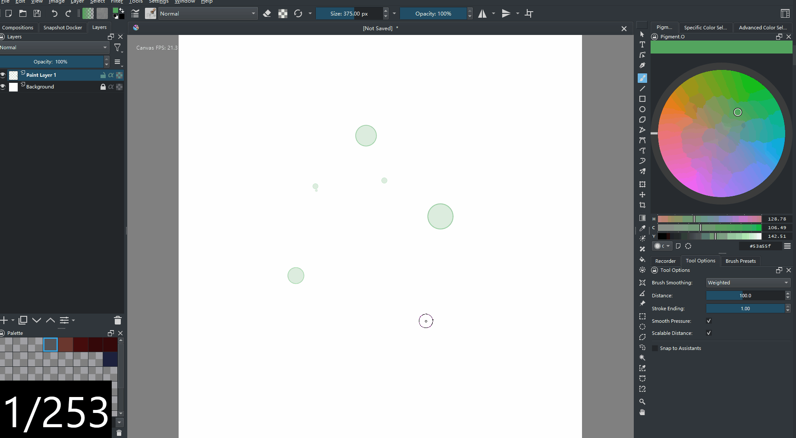
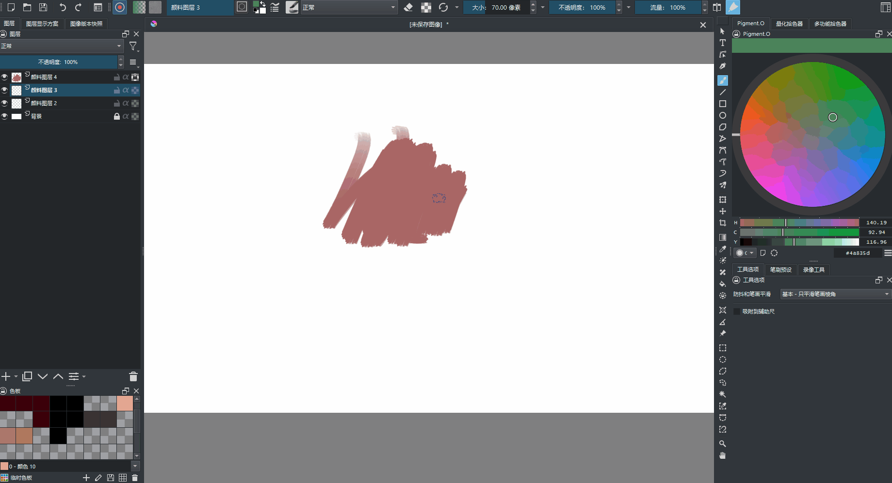
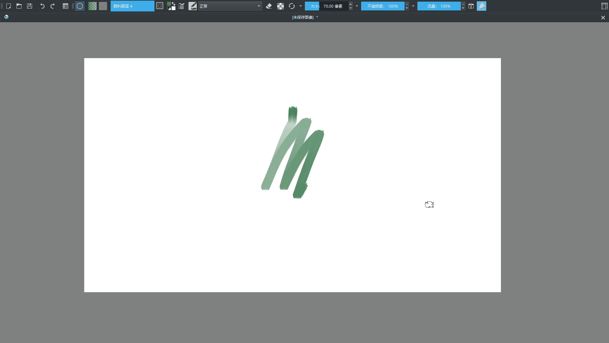
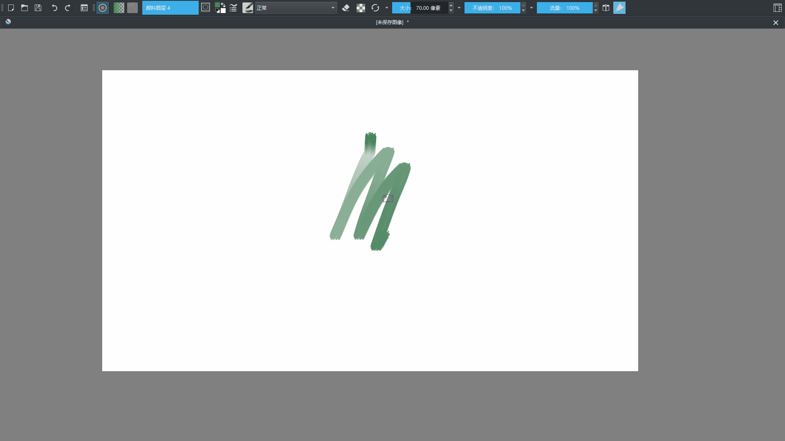

# Docker Under Cursor

中文 | [English](README.md)

## 介绍

Docker Under Cursor 是一款 [Krita](https://krita.org/) 插件，可通过快捷键将面板浮动显示在光标位置，减少鼠标或数位笔的移动。它也支持其他插件提供的面板，例如 [Pigment.O](https://github.com/EyeOdin/Pigment.O) 调色板。

## 功能

- 为每个已启用的面板分配快捷键。按下快捷键后，面板会显示在光标位置；再次按下，则根据原先状态隐藏面板或将其停靠回主窗口。
- 通过三个可选设置调整浮动行为：
  - **Remember cursor position within the docker**：记住上次面板还原或隐藏时光标在面板内的相对位置。关闭后，面板中心将对齐光标。
  - **Keep floating dockers inside the main window**：将浮动面板的位置限制在主窗口内。
  - **Restore dockers when the cursor leaves**：光标离开浮动面板后，自动隐藏面板、重新停靠，或将其移回固定位置。
- 将光标移到浮动面板上，按 **Ctrl + 反引号（\`）** 即可固定面板。此后，面板快捷键会让它在固定位置和光标位置之间切换。再次按固定快捷键可取消固定。
- 若要在切换画布模式时保留固定面板的位置与状态，可将 **Tab** 绑定到 **DUC Toggle Canvas-Only Mode**；请先移除冲突的 Tab 绑定。

## 预览

### 快速调出面板



### 记住光标的相对位置



### 保持面板位于主窗口内



### 固定浮动面板



## 安装

1. 在仓库页面选择 **Code → Download ZIP**。
2. 在 Krita 中选择 **工具 → 脚本 → 从文件导入 Python 插件**，打开下载的 ZIP 文件。
3. 在弹窗中确认启用插件，然后**重启 Krita**。

如果插件尚未启用，请打开 **配置 Krita → Python 插件管理器**，启用 **Docker Under Cursor** 后重启 Krita。

## 使用

1. 打开 **工具 → 脚本 → DUC Settings**。
2. 勾选需要控制的面板，点击 **Save**。
3. **重启 Krita**，加载所选面板的快捷键动作。
4. 打开 **配置 Krita → 键盘快捷键 → Scripts → Docker Under Cursor/ Dockers**，为各面板分配快捷键。
5. 使用快捷键调出或还原面板。

快捷键条目使用 Krita 内部的面板 ID，可能与界面标题不同，可参考下方对照表。固定面板和切换画布模式的动作位于 **Docker Under Cursor: Other Actions** 分类中。

三个行为选项在点击 **Save** 后立即生效；修改启用的面板列表后，需要重启 Krita。

## 已知问题

- 某些带有滚动条的面板（如色板、笔刷预设）在反复浮动和停靠后，高度可能变小。将面板浮动后，手动拖回主窗口的停靠区域，即可恢复正常尺寸。

## 开发与维护

插件需要在 Krita 中运行，依赖其提供的 `krita` 模块和 PyQt。

- `docker_under_cursor.py`：扩展注册与动作初始化。
- `docker_visibility_toggler.py`：面板定位、显示状态与固定状态管理。
- `action_hold_filter.py`、`docker_auto_hide_filter.py`：快捷键和鼠标事件处理。
- `setting_panel.py`：设置对话框与动作定义文件的生成。
- `qt_event.py`：调试用的 Qt 事件名称对照表。

安装 [uv](https://docs.astral.sh/uv/) 后，在仓库根目录执行：

```sh
uvx ruff check .
uvx ruff format --check .
python -m compileall -q dockerundercursor
```

使用 `uvx ruff format .` 格式化 Python 源码。格式与静态检查规则见 `pyproject.toml`，编辑器默认设置见 `.editorconfig`。

内部方法和变量使用 `snake_case`，类使用 `PascalCase`，常量使用 `UPPER_SNAKE_CASE`。Krita 和 Qt 的回调名称（如 `createActions`、`eventFilter`）、已有动作 ID 以及持久化配置键应保持兼容。

界面交互需在 Krita 中验证：启用面板并重启、分配快捷键、切换停靠与隐藏面板、逐项检查三个行为选项、固定与取消固定面板，以及在面板位于固定位置和临时光标位置时分别切换画布模式。
